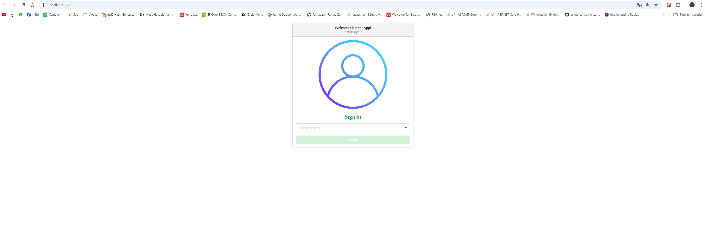
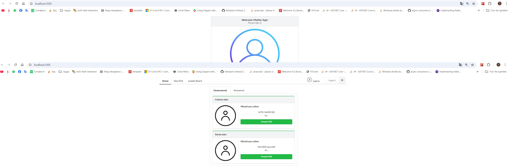

# Would You Rather
Would You Rather  polling game that presents the user with a series of questions.



It's built project with React, Redux, React Router, & Redux Thunk.

This application is a homework application provided by the Udacity platform.

## Installation

Clone the repository, change directories, and use NPM to install the dependencies.

```bash
$ git clone https://github.com/tayfunuyrun-aygaz/UdacityExample2.git
$ cd UdacityExample2
$ npm install
```


## Usage

The project can be run with

- `npm start`

The project can be stopped as follows

- `Ctrl+C => Y`

The project can be viewed in the browser at

- [http://localhost:3000](http://localhost:3000)

## Screenshots

